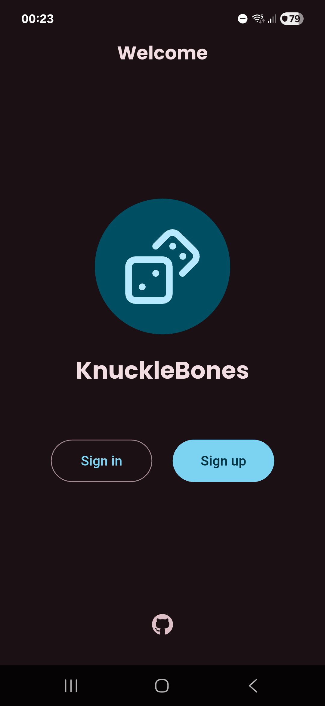
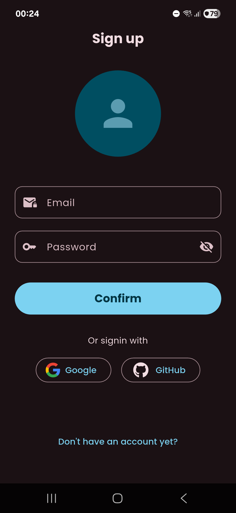
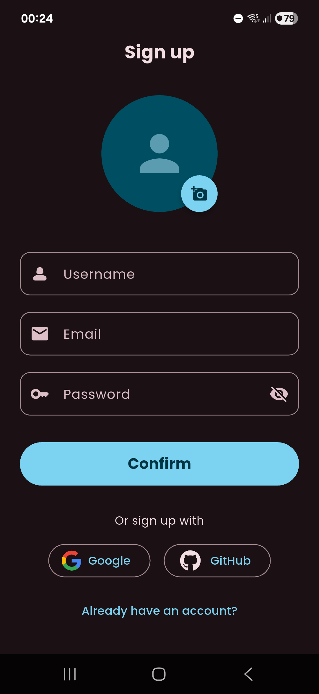
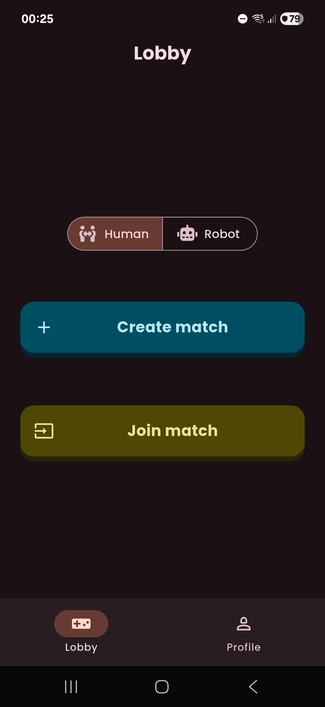
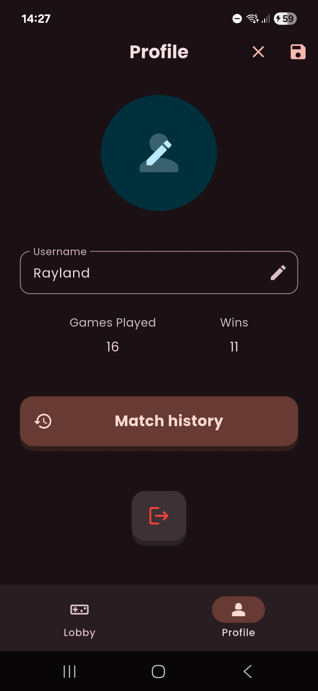
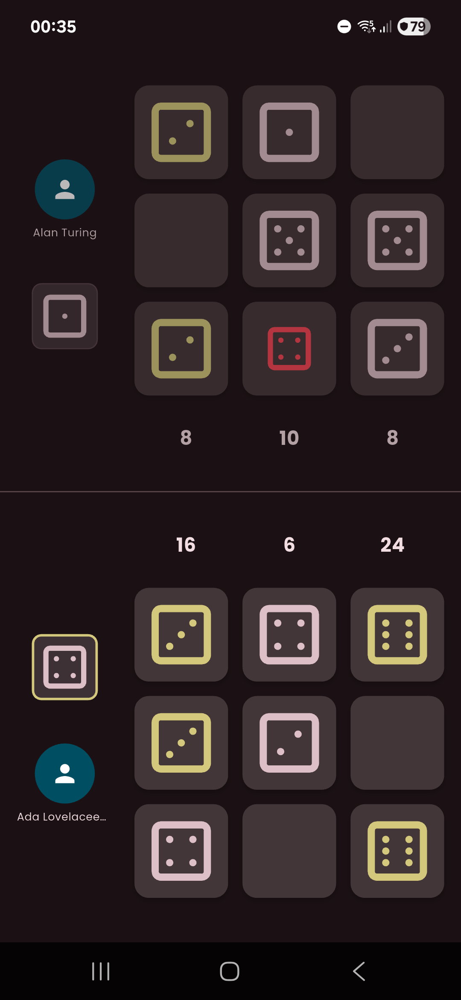

<h1>KnuckleBones</h1>
A Flutter app that features a 1v1 multiplayer dice game based on the mechanics of the Knuckle Bones minigame found in Cult of the Lamb. 

# 🧩 Previews and Features

## Welcome and Authentication
<p align="center">
  
  
  
</p>

## Home and Match
<p align="center">
  
  
  
</p>

# 🧰 Toolbox

<p align="center">
  <a href="https://skillicons.dev">
    
  </a>
</p>
<br/>

# 🚀 How to Run

## Prerequisites
- Firebase project
- Flutter (3.38.5 or other compatible version)
- FVM (optional, but recommended)

## 1. Clone the repository

```
 git clone https://github.com/VorAd2/knuckle-bones
 cd knuckle-bones
```

## 2. Create a Firebase project and install Firebase SDK
- <a href='https://console.firebase.google.com'> Firebase Console </a>
- <a href='https://firebase.google.com/docs/flutter/setup?platform=android'> Firebase Setup </a>

## 3. Install dependencies

```
fvm flutter pub get
```

## 4. Run !!
Here are two useful links teaching you how to run a Flutter app on mobile devices:
- <a href='https://youtu.be/yxif9Tj8fDE?si=H1UAFWMO05MYUVre'> Physical device </a>
- <a href='https://docs.flutter.dev/platform-integration/android/setup'> Virtual device </a>

<hr/>

A few resources to get you started if this is your first Flutter project:

- [Lab: Write your first Flutter app](https://docs.flutter.dev/get-started/codelab)
- [Cookbook: Useful Flutter samples](https://docs.flutter.dev/cookbook)

For help getting started with Flutter development, view the
[online documentation](https://docs.flutter.dev/), which offers tutorials,
samples, guidance on mobile development, and a full API reference.
